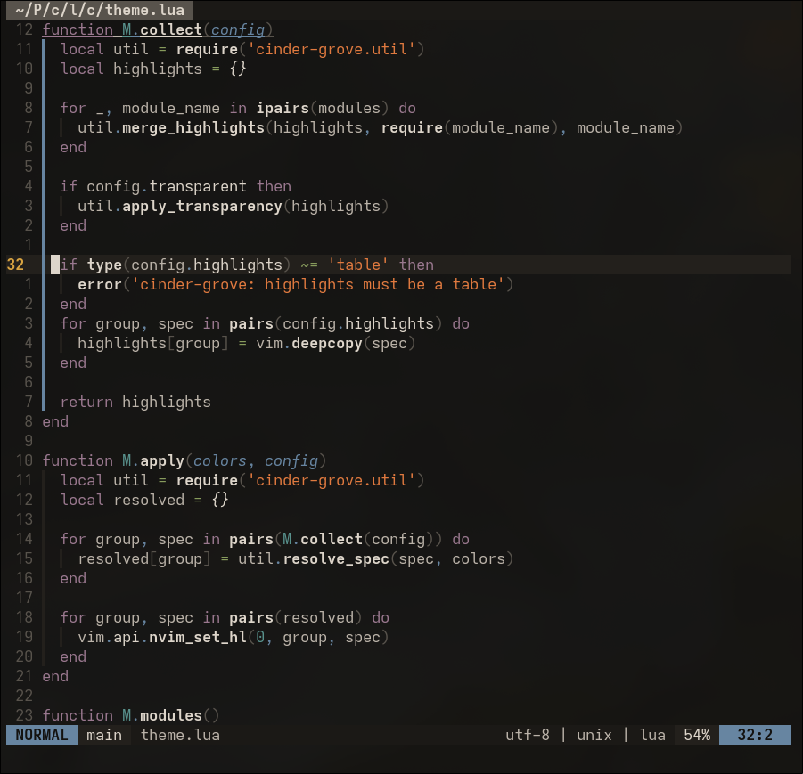

# Cinder Grove

> [!NOTE]  
> Report issues on [Codeberg](https://codeberg.org/aileks/cinder-grove.nvim/issues)

A warm, muted Neovim colorscheme that's easy on the eyes.



## Ports

[VS Code](https://codeberg.org/aileks/cinder-grove)
[GTK](https://codeberg.org/aileks/cinder-grove-gtk)

## Features

- Modern Neovim UI, syntax, Tree-sitter, LSP, diagnostics, and semantic tokens
- Language-specific groups for Markdown, structured data, web, Lua, Go, Python, Rust, shell, and JavaScript/TypeScript
- Plugin integrations with no plugin setup or import-time side effects
- Lualine auto-discovery through `theme = 'auto'`
- Optional transparency, palette overrides, highlight overrides, and terminal colors

## Installation

lazy.nvim:

```lua
{
  'aileks/cinder-grove.nvim',
  lazy = false,
  priority = 1000,
  config = function()
    vim.cmd.colorscheme('cinder-grove')
  end,
}
```

Neovim's built-in package manager:

```lua
vim.pack.add({
  { src = 'https://github.com/<user>/cinder-grove.nvim' },
})
vim.cmd.colorscheme('cinder-grove')
```

Locally:

```lua
vim.opt.runtimepath:prepend('/path/to/cinder-grove.nvim')
vim.cmd.colorscheme('cinder-grove')
```

## Configuration

Calling `setup()` is optional. It configures the theme but does not load it.

```lua
require('cinder-grove').setup({
  transparent = false,
  terminal_colors = true,
  colors = {},
  highlights = {},
})
vim.cmd.colorscheme('cinder-grove')
```

### Transparency

Enable transparency while keeping floating windows opaque:

```lua
require('cinder-grove').setup({ transparent = true })
vim.cmd.colorscheme('cinder-grove')
```

### Palette

Cinder Grove uses portable semantic roles for UI layers, text hierarchy, brand accents, and status colors.

| Token            | Hex       | Common use                                |
| ---------------- | --------- | ----------------------------------------- |
| `background`     | `#131210` | App or editor background                  |
| `container`      | `#1B1916` | Panels, popovers, and code blocks         |
| `surface`        | `#23201C` | Raised or interactive regions             |
| `overlay`        | `#58534C` | Selections and active controls            |
| `text_muted`     | `#58534C` | Disabled text and lowest emphasis         |
| `text_subtle`    | `#9A938A` | Metadata and supporting text              |
| `text_secondary` | `#ACA49B` | Secondary text                            |
| `text`           | `#BBB3A9` | Default text                              |
| `text_bright`    | `#DDD5CA` | High-emphasis text                        |
| `primary`        | `#E17A3F` | Main accent, cinder orange                |
| `secondary`      | `#879B5C` | Secondary accent, grove green             |
| `error`          | `#B34A45` | Errors, destructive actions, and removals |
| `warning`        | `#D9A441` | Warnings and attention states             |
| `success`        | `#879B5C` | Success states and additions              |
| `info`           | `#6785A1` | Informational states and links            |
| `purple`         | `#9A788F` | Supporting accent and keywords            |
| `cyan`           | `#58918C` | Supporting accent, types, and hints       |

### Palette overrides

Palette values must use six-digit hexadecimal colors. Existing names can be replaced and new names can be used by custom highlights.

Highlight colors may be palette names, `#RRGGBB`, or `NONE`. Other `nvim_set_hl()` fields pass through unchanged.

```lua
require('cinder-grove').setup({
  colors = {
    background = '#101010',
    custom = '#6F8050',
  },
  highlights = {
    Normal = { fg = 'text', bg = 'background' },
    MyHighlight = { fg = 'custom', bold = true },
  },
})
```

## Integrations

Cinder Grove defines highlights for:

- blink.cmp and nvim-cmp
- flash.nvim
- fzf-lua and optional fzf.vim colors
- gitsigns.nvim and neogit
- indent-blankline.nvim
- lazy.nvim
- lualine.nvim
- markdown-plus.nvim
- mini.icons and minimap.vim
- obsidian.nvim, org-bullets.nvim, and render-markdown.nvim
- oil.nvim
- telescope.nvim
- trailblazer.nvim
- which-key.nvim

### fzf.vim and minimap.vim

These plugins require configuration in addition to highlight groups:

```lua
vim.g.fzf_colors = require('cinder-grove.extras').fzf_colors()

for name, value in pairs(require('cinder-grove.extras').minimap()) do
  vim.g[name] = value
end
```
